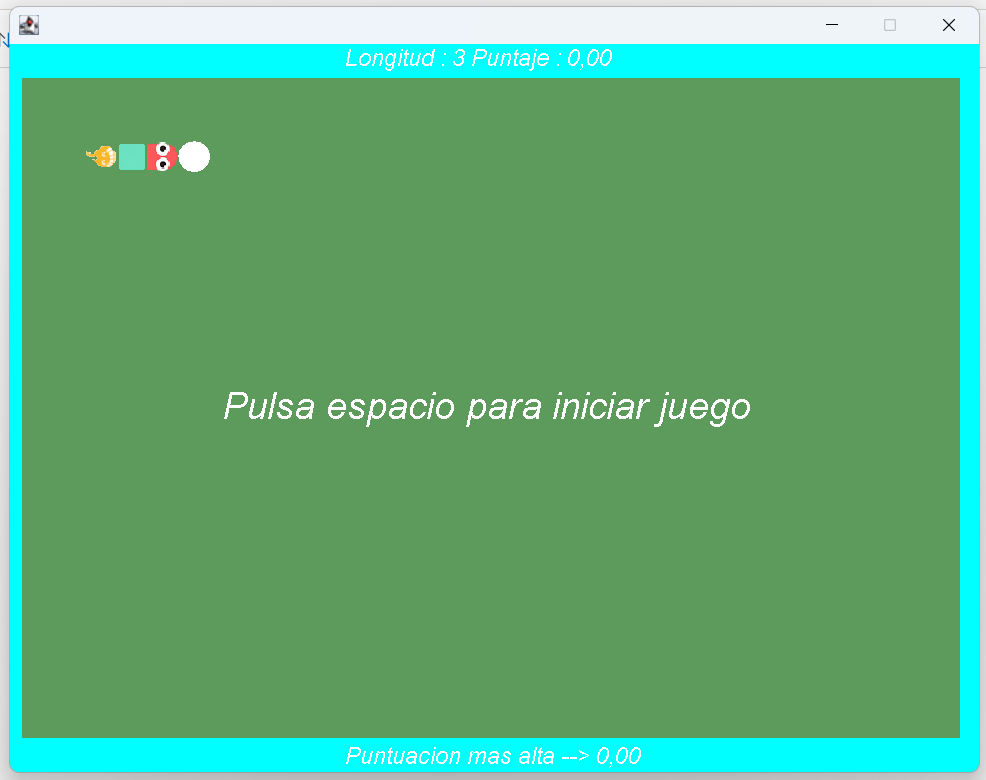
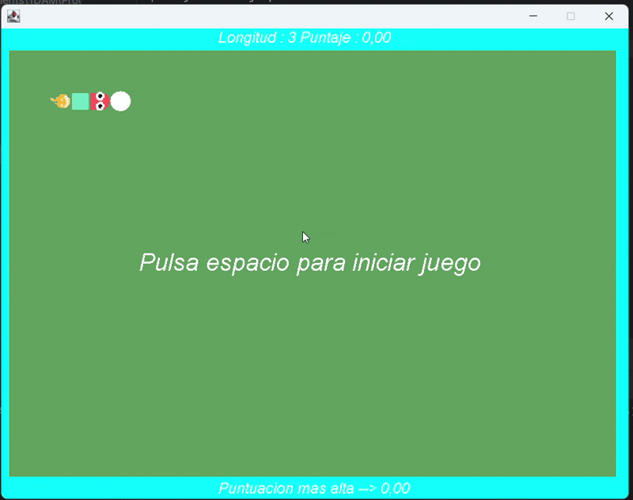
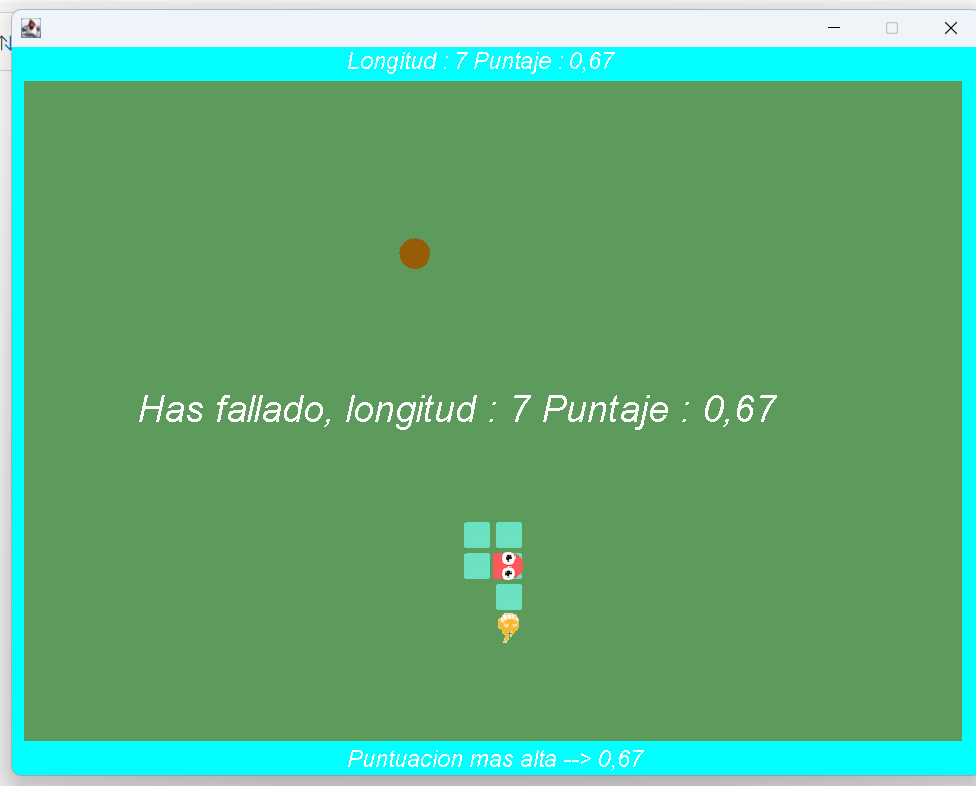

这是一个基于JAVA语言，狂神说JAVA的视频，用INTELI J 做的贪吃蛇游戏。 欢迎任何人对其优化和更改。关于随机食物的算法有些粗糙，有空我会更新以提高性能。
>>>>>>> b9b3547 (fixed conflict)

This is a small game based on Java created using IntelliJ. Any optimizations and changes are welcome.

Este es un pequeño juego de Snake desarrollado en Java usando IntelliJ, basado en el video de "狂神说 Java". Se agradecen todas las optimizaciones y mejoras. El algoritmo para generar comida es algo rudimentario; planeo mejorarlo más adelante para un mejor rendimiento.

---

## 游戏截图 / Game Screenshots / Capturas del Juego

- **游戏开始 / Game Start / Inicio del juego**  
  

- **游戏进行中 / Playing the Game / Jugando**  
  

- **游戏结束 / Game Over / Fin del juego**  
  

---

## 开发环境 / Development Environment / Entorno de desarrollo

- **语言 / Language / Lenguaje**: Java
- **IDE**: IntelliJ IDEA
- **参考视频 / Reference Video / Video de referencia**: 狂神说 Java 教程

欢迎参考和优化！  
Feel free to explore and optimize!  
¡Bienvenidos a revisar y mejorar el código!
